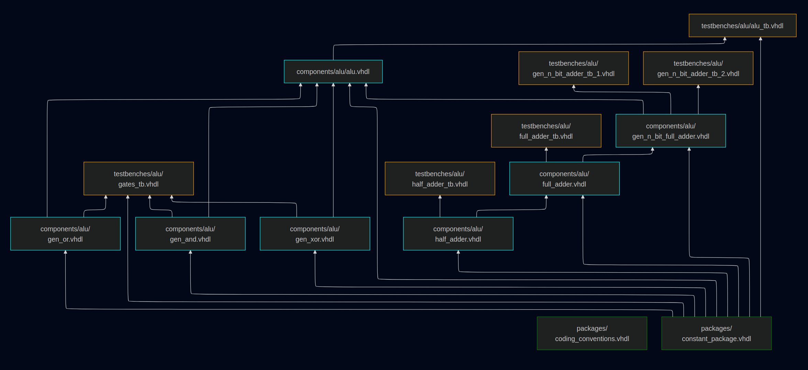

# vhdlmake

<div align="center">



An awesome build system made for my uni vhdl projects.

</div>

<br>

This build system automaticaly infers the dependencies between vhdl files
and compiles only the necerssary files when a or multiple files were changed.
It builds a DAG and a partial DAG based on the updated files and uses these to
determine which files need to be rebuilt/analysed. In comparison to make, vhdlmake
inverts its DAG. Instead of "listing" the dependencies, each node lists its dependants.
This is useful, because now the edges point directly to the files
that need to be updated. Generating the correct compile commands is now as simple
as building the partital DAG and running a topological sort on that.
This approach is inspired by the [Tup Build System](https://gittup.org/tup/build_system_rules_and_algorithms.pdf).

### Usage
```bash
vhdlmake build [entity] - builds project and optionaly elaborates <entity>
vhdlmake run   <entity> - builds project and runs <entity>
vhdlmake info  <entity> - show info for <entity>
vhdlmake graph          - get dependency graph as mermaid url
vhdlmake graph*         - get partial dependency graph as mermaid url (only updated files and deps)
```

### Clone and Build
```bash
git clone --recursive https://github.com/gigalasr/vhdlmake.git
cd vhdlmake
mkdir build
cd build
cmake ..
make 
```

If you forgot to clone with ``--recursive`` you can run ``git submodule update --init`` to clone the submodules afterwards.